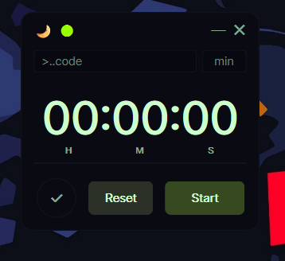

a timer with:
1. transparency controls(use ctrl and scroll)
2. logs sessions into your daily note on your obsidian vault
3. customizable interface(font,opacity,colors(accented and main))
4. time overflow logic added

### Timer In Action  

### Terminal Feel  

### Minimal Goth  

### Plain  

---

My way of using it is using a autohotkey script to launch a .bat file that runs the python file. 
(for plain testing purpose just download the timer.py and open it in vs code and click run)
The code for the mentioned script is::
---
'''
#Requires AutoHotkey v2.0
#SingleInstance Force

; === Centralized App Launcher (Alt+T) for AHK v2 ===
; Press Alt+T → then press 1 key within 3s → launch/close mapped Python script

; --- CONFIG ---
projectFolder := "C:\Users\DELL\Documents\custom-apps"  ; your app folder

; Mapping: singleKey => [WindowTitle, PythonScript]
; Add new apps here (single-letter keys recommended)
apps := Map()
apps["1"] := ["Stopwatch", "stopwatch.py"]
apps["3"] := ["Timer",     "timer.py"]
apps["2"] := ["Countdown", "countdown.py"]

; --- HOTKEY ---
<!t:: {  ; Alt+T
    ih := InputHook("L1 T3")   ; L1 = one char, T3 = 3s timeout
    ih.Start()
    ih.Wait()
    userKey := ih.Input

    if (userKey != "")
        RunPythonApp(userKey)
}

; --- FUNCTION ---
RunPythonApp(key) {
    global apps, projectFolder

    if !apps.Has(key) {
        TrayTip("App Launcher", "No app mapped to key: " key, 2)
        return
    }

    appInfo := apps[key]
    winTitle := appInfo[1]
    script   := appInfo[2]

    if hwnd := WinExist(winTitle) {
        WinClose(hwnd)
    } else {
        cmd := Format('pythonw.exe "{1}\{2}"', projectFolder, script)
        Run(cmd, projectFolder)
    }
}
'''